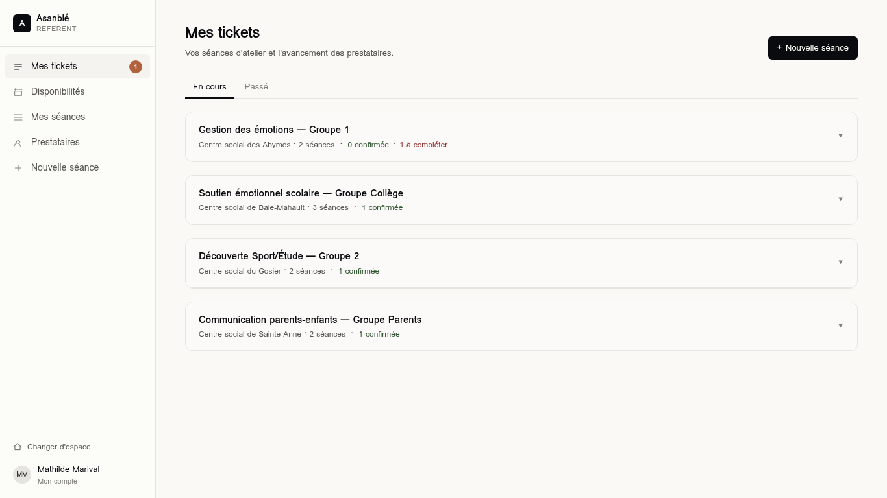
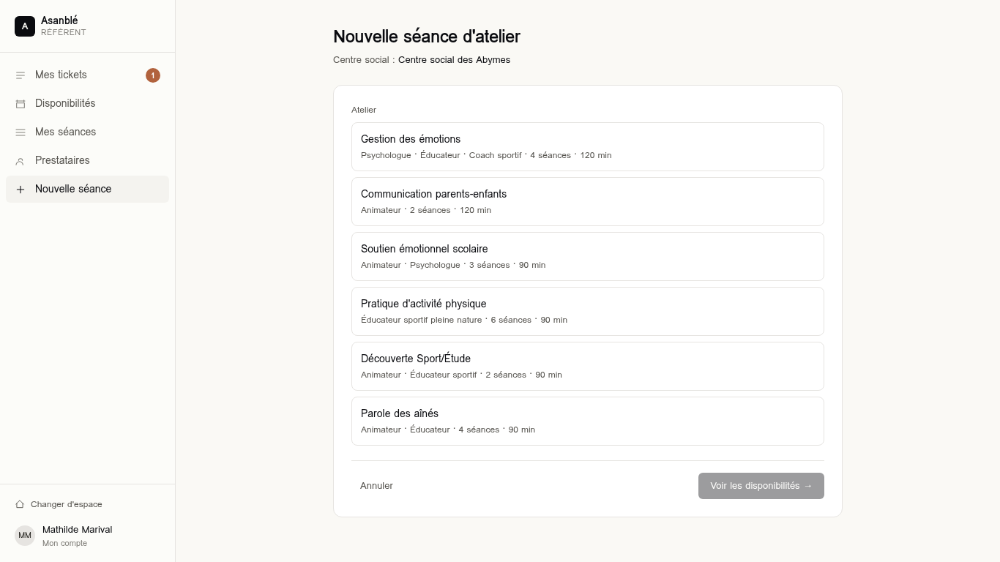
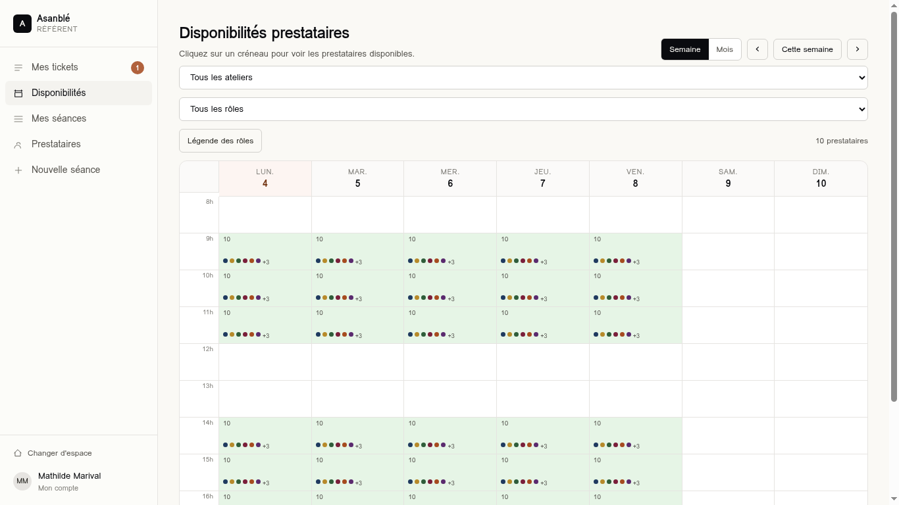

# 05 — Espace Référent famille

URL préfixe : `/app/*`. Layout : `src/routes/app.tsx` (`AppLayout`) qui
applique `setCurrentUserByRole("referent")` au mount.

## Sidebar

Définie dans `app.tsx` :

| Label | Route | Icon (path SVG) | Badge dynamique |
| --- | --- | --- | --- |
| Mes tickets | `/app` (exact) | 3 traits horizontaux | Nb tickets `refused` |
| Disponibilités | `/app/availability` | Calendrier | — |
| Mes séances | `/app/calendar` | Lignes | — |
| Prestataires | `/app/providers` | Personne | — |
| Nouvelle séance | `/app/sessions/new` | + | — |

> Note : la sidebar contient déjà l'entrée "Nouvelle séance" mais l'écran
> `/app` propose aussi un CTA primaire "Nouvelle séance" en haut.

---

## Écran : Mes tickets (Accueil)

- **Route** : `/app` (exact)
- **Fichier** : `src/routes/app.index.tsx`
- **Accès** : référent.
- **Données lues** : `sessions`, `seancesForSession`, `ticketsForSeance`,
  `seanceStatus`, `getProvider`, `getWorkshop`, `getCenter`,
  `suggestionsForRole`, `providers`.
- **Données écrites** : aucune (le picker ferme sans muter dans la maquette).
- **Layout** : 1 colonne, `max-w-[1100px]`.

### Sections

1. **Header** — Titre "Mes tickets" + sous-titre, CTA primaire "+ Nouvelle séance".
2. **Tabs** — "En cours" / "Passé". Filtre les séances par date (futur vs passé).
3. **Liste des sessions** (accordéon) — pour chaque session :
   - Bandeau cliquable (titre, centre, compteurs `confirmées` / `à compléter`).
   - Quand ouvert : liste des séances ; chaque séance affiche les
     `RoleSlot` (un par ticket).

### Composant interne `RoleSlot`

Pour chaque ticket :
- Si `provider && status not in (empty, refused)` → carte simple
  (avatar, nom, rôle · ville, `StatusChip`).
- Sinon → carte pointillée "Manque <rôle>" + suggestions (top 2 prestataires
  via `suggestionsForRole`) + lien "Voir tous" → ouvre `SideDrawer`.

### Boutons / actions

- **+ Nouvelle séance** → `/app/sessions/new`.
- **Tab En cours / Passé** → setState local.
- **Toggle session** → étend / replie.
- **Suggestion `+ Prénom N.`** ou **Voir tous** → ouvre `SideDrawer` avec
  liste filtrée par rôle. Clic sur un prestataire → ferme (à câbler : muter
  ticket en `pending`).
- **Item séance** → `/app/sessions/$sessionId/seances/$n`.

### Règles métier

- "En cours" = `seance.start >= today`, "Passé" = sinon.
- Compteurs bandeau : `nbConfirmed = count(status in confirmed|done)`,
  `nbBlocked = count(status in blocked|empty)`.

### Évolutions

- Brancher le picker → `mutateTicket(ticketId, { providerId, status: "pending" })`.
- Notifier le prestataire choisi.

---

## Écran : Nouvelle séance d'atelier

- **Route** : `/app/sessions/new`
- **Fichier** : `src/routes/app.sessions.new.tsx`
- **Accès** : référent.
- **Données lues** : `workshopsStore`, `centersStore`, `currentUserStore`.
- **Données écrites** (cible) : créer `Session`, créer N `Seance`, créer
  `requiredRoles.length` `Ticket` `empty`.
- **Layout** : 1 colonne `max-w-[760px]`.

### Sections (haut → bas)

1. **Header** — Titre + ligne "Centre social : <nom du centre du référent>"
   (lecture seule, **imposé** par `currentUser.centerId`, jamais demandé).
2. **Carte unique** :
   - Liste des ateliers (sélection radio en cartes). Sélection → autoremplit
     `workshopName`, durée, etc. Chaque carte affiche les `label` des slots
     requis (et non plus les rôles bruts).
   - Si atelier sélectionné, apparaît :
     - **Bloc "Rôles nécessaires pour cette séance"** : un item par
       `RoleSlot` de l'atelier, pré-coché. Chaque item affiche :
       - le `label` du slot ("Animateur requis — 1 personne"),
       - en dessous, les `acceptedRoles` réels (avec `RoleDot` + nom) ;
         si plusieurs, la mention "l'un OU l'autre :" précède la liste.
       Le référent peut décocher un slot non requis pour cette séance
       précise. Les slots décochés seront tracés comme tickets
       `skipped` (visibles mais inactifs) dans la séance ; ils n'apparaissent
       pas dans le filtre du calendrier suivant.
     - Grille 3 colonnes : `Nom de l'atelier`, `Numéro de la session`,
       `Numéro de la séance`.
     - Bandeau "Nom précis de l'atelier" (lecture seule, format
       `${workshopName} — Session ${n} · Séance ${n}`).
     - Champ "Notes pour le prestataire (optionnel)" — textarea.
     - Encadré info indiquant le nombre de slots actifs / total.
   - Footer : Annuler (gauche) + "Voir les disponibilités →" (droite,
     primaire, disabled tant qu'aucun atelier sélectionné OU aucun slot coché).

### Boutons / actions

- **Annuler** → `/app`.
- **Voir les disponibilités →** →
  `/app/availability?workshopId=<id>&slots=<idx,idx,...>`.
  L'écran cible verrouille le filtre rôle sur l'**union des `acceptedRoles`**
  des slots actifs uniquement.

### Règles métier

- Le centre social n'est **jamais** demandé (cf. session 2 du brief).
- `fullName` n'est PAS persisté tel quel : c'est une concaténation dérivée
  pour affichage. Persister séparément : `workshopId`, `sessionNumber`,
  `seanceNumber`.
- Le numéro de séance est borné par `workshop.seancesCount` (input `max`).
- Pour chaque slot **coché** → 1 ticket `empty` créé sur la séance.
  Pour chaque slot **décoché** → 1 ticket `skipped` créé (trace conservée,
  réactivable plus tard).
- Date / heure / durée : actuellement non demandés sur cet écran (la date
  est choisie à l'étape suivante via le calendrier des dispos).

### Évolutions

- Server function `createSession({ workshopId, sessionNumber, notes })` qui
  retourne `sessionId` et crée les `Seance` vides.
- Validation Zod côté client + server.

---

## Écran : Disponibilités prestataires

- **Route** : `/app/availability?workshopId=<id?>&slots=<idx,idx,...>`
- **Fichier** : `src/routes/app.availability.tsx`
- **Accès** : référent.
- **Données lues** : `providers`, `availabilities`, `workshopsStore`,
  `roleColorsStore`.
- **Données écrites** (cible) : créer un `Ticket` `pending` à la sélection
  d'un prestataire.
- **Layout** : `max-w-[1300px]`.
- **Search params** :
  - `workshopId` (string optional) — atelier qui verrouille le filtre.
  - `slots` (string optional) — indices des slots actifs séparés par `,`
    (ex. `"0,2"`). Si absent, tous les slots de l'atelier sont actifs.

### Sections (haut → bas)

1. **Header** : titre + sous-titre, et à droite :
   - Toggle "Semaine / Mois".
   - Navigation : `‹`, "Cette semaine" / "Aujourd'hui", `›`.
2. **Barre de filtres** :
   - Select "Tous les ateliers" / liste des ateliers (verrouille les rôles
     si sélectionné).
   - Select "Tous les rôles" / `RoleName[]` (disabled si atelier sélectionné).
   - Badge accent "Filtré sur : <labels des slots actifs>" si atelier
     sélectionné (affiche les `label`, pas les `acceptedRoles`).
   - Bouton "Légende des rôles" (toggle).
   - Compteur "<n> prestataires" à droite.
3. **Légende** (si dépliée) : pastille + nom de chaque rôle visible.
4. **Calendrier** :
   - **Vue Semaine** : grille 60px + 7 colonnes ; 11 lignes (8h..18h),
     `SLOT_H = 56`. Chaque cellule :
     - Couleur de fond proportionnelle à la densité de prestataires.
     - Compteur en haut à gauche.
     - Pastilles `RoleDot` en bas (max 6 + "+N").
     - `title` (tooltip) : `"Rôle — Nom"` ligne par ligne.
     - Cellule disabled si aucun prestataire.
   - **Vue Mois** : grille 7 colonnes (Lun..Dim) ; chaque jour montre
     `<n>h dispo` + pastilles rôles.
5. **`BookingDrawer`** (déclenché par clic sur cellule) :
   - Position : sticky bottom-right (mobile : full width).
   - Header : `<jour court · Hh00>` + compteur.
   - Body : prestataires **groupés par rôle réel** (`RoleName`) ; chaque
     groupe préfixé par `RoleDot` + nom du rôle dans la couleur du rôle.
   - Clic sur prestataire → ferme (à câbler).

### Filtre intelligent (clé)

- Si `selectedWorkshop` :
  - `activeSlots` = slots du workshop dont l'index est dans `slots` (ou
    tous si `slots` absent).
  - `allowedRoles` = **union des `acceptedRoles`** de tous les `activeSlots`.
  - `visibleProviders` = prestataires ayant **au moins un rôle** dans
    `allowedRoles`.
  - Les rôles hors `allowedRoles` sont **masqués** des pastilles et des
    groupes du `BookingDrawer`.
- Sinon, le filtre rôle libre (select) s'applique.

> Conséquence métier : pour un atelier avec un slot "Animateur"
> acceptant `["Animateur extérieur", "Animateur jardin"]`, le calendrier
> affiche les disponibilités des deux rôles indistinctement, et le choix
> final dépend du créneau retenu.

### Évolutions

- Brancher le bouton "Demander →" : créer un ticket `pending` lié à la séance
  contextuelle (fournie par `workshopId` + créneau).
- Mettre à jour `BookingDrawer` pour montrer aussi l'overlap avec d'autres
  bookings du même jour (pour éviter les doublons).

---

## Écran : Mes séances (calendrier)

- **Route** : `/app/calendar`
- **Fichier** : `src/routes/app.calendar.tsx`
- **Accès** : référent.
- **Données lues** : `sessions`, `seances`, `getWorkshop`, `getCenter`,
  `seanceStatus`, `colorForSession`.

### Sections

1. Header : titre + plage `<lun → dim>`, navigation `‹ Aujourd'hui ›`.
2. Grille semaine (même structure que `/app/availability` vue Semaine).
3. Évènements positionnés en absolu (`top` = `(startH-8)*SLOT_H`,
   `height` = `(durationMin/60)*SLOT_H`), couleur via `colorForSession`.
4. Clic sur évènement → `SideDrawer` avec : Quand, Lieu (centre + adresse),
   Groupe + Séance N.

### Évolutions

- Filtrer sur `currentUser.centerId` quand l'auth sera réelle (aujourd'hui
  toutes les sessions sont affichées).
- Vue Mois.

---

## Écran : Détail Session

- **Route** : `/app/sessions/$sessionId`
- **Fichier** : `src/routes/app.sessions.$sessionId.tsx`
- **Accès** : référent.

### Sections

1. Lien retour "‹ Retour aux tickets" → `/app`.
2. Header : `${workshop.name} — ${session.groupLabel}` + `<centre · ville · N
   séances>`.
3. **Carte "Détails"** : grille 2 colonnes — Salle, Public, Notes.
4. **Timeline des séances** : liste chronologique. Chaque item est un Link
   vers `/app/sessions/$sessionId/seances/$n` :
   - Vignette n° séance.
   - Titre "Séance N" + date.
   - Compteur de commentaires (icône bulle).
   - `StatusChip` du statut dérivé.

---

## Écran : Détail Séance (ticket)

- **Route** : `/app/sessions/$sessionId/seances/$n`
- **Fichier** : `src/routes/app.sessions.$sessionId.seances.$n.tsx`
- **Accès** : référent.
- **Note** : `$n` est l'index de la séance dans la session (1..N), pas son id.

### Sections

1. Lien retour vers `/app/sessions/$sessionId`.
2. Header : "Séance N" + date + centre.
3. **Carte "Rôles requis"** :
   - Header : compteur "X / Y pourvus".
   - Liste de tickets ; chaque ligne : rôle (uppercase tiny), prestataire
     (avatar, nom, ville) ou "Aucun prestataire", `StatusChip`, et 1 action
     contextuelle :
     - `pending` → "Relancer"
     - `empty | refused` → "+ Inviter"
     - `confirmed` → "Réassigner"
4. **`CommentsThread`** sous la carte (`currentRole="referent"`,
   `currentName=session.referentName`).

### Évolutions

- Câbler les actions sur de vraies mutations.
- Historique d'audit : qui a confirmé / refusé / réassigné.

---

## Écran : Annuaire prestataires

- **Route** : `/app/providers`
- **Fichier** : `src/routes/app.providers.tsx`

### Sections

1. Header : titre + compteur, CTA "+ Proposer un prestataire" (ouvre
   `SideDrawer` avec formulaire envoyé à l'admin).
2. Filtres : recherche texte + select rôle.
3. Grille 2 colonnes de cartes prestataires (avatar, nom, rôles, ville).
4. Clic carte → `SideDrawer` détail (avatar 56, rôles, contact tél).

### Évolutions

- Connecter "+ Proposer" à un endpoint admin (`/admin/providers/proposals`).
