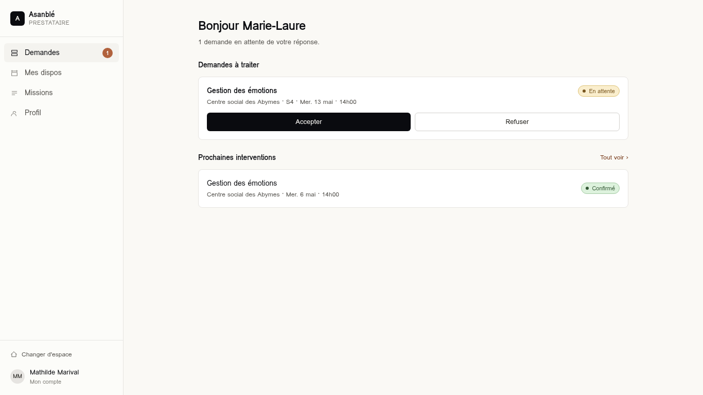
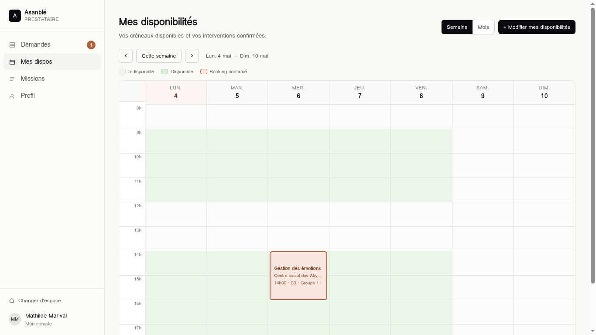

# 06 — Espace Prestataire

URL préfixe : `/pro/*`. Layout : `src/routes/pro.tsx` (`ProLayout`) qui
applique `setCurrentUserByRole("provider")` au mount.

> Dans la maquette, le prestataire courant est **codé en dur** :
> `PROVIDER_ID = "p1"` (Marie-Laure Cadet, Psychologue, Pointe-à-Pitre).
> À remplacer par `currentUser.providerId` quand l'auth sera réelle.

## Sidebar

| Label | Route | Badge dynamique |
| --- | --- | --- |
| Demandes | `/pro` (exact) | Nb tickets `pending` pour `p1` |
| Mes dispos | `/pro/dispos` | — |
| Missions | `/pro/missions` | — |
| Profil | `/pro/profile` | — |

---

## Écran : Demandes (Accueil)




- **Route** : `/pro` (exact)
- **Fichier** : `src/routes/pro.index.tsx`
- **Données lues** : `tickets` filtrés par `providerId === PROVIDER_ID`.

### Sections

1. **Header** : "Bonjour <prénom>" + sous-titre nb demandes en attente.
2. **Demandes à traiter** (`status === "pending"`) :
   - Carte par demande : workshop + centre · "S<idx> · <date>" + `StatusChip`.
   - 2 boutons côte à côte pleine largeur : **Accepter** (primaire) /
     **Refuser** (secondaire).
3. **Prochaines interventions** (`status === "confirmed"`) :
   - Lien "Tout voir ›" → `/pro/missions`.
   - Liste compacte (workshop, centre + date, `StatusChip`).

### Évolutions

- Brancher Accepter / Refuser sur `respondTicket(ticketId, "confirmed" | "refused")`.
- Trier "Demandes à traiter" par date de séance asc.

---

## Écran : Mes disponibilités




- **Route** : `/pro/dispos`
- **Fichier** : `src/routes/pro.dispos.tsx`
- **Données lues** : `bookingsForProvider("p1")`, etat local
  (`recurring[]`, `exceptions[]`).

### Sections

1. **Header** : Titre + sous-titre, toggle "Semaine / Mois", bouton primaire
   **+ Modifier mes disponibilités** (ouvre `SideDrawer` "Éditeur").
2. **Vue Semaine** :
   - Navigation `‹ Cette semaine ›`.
   - Légende : Indisponible / Disponible / Booking confirmé.
   - Grille 7j × 11h (8h-18h), même structure que `/app/availability`.
   - Cellule colorée (`bg-s-confirmed-bg/60`) si `isAvail()` retourne `true`.
   - Évènements (bookings confirmés) en absolu, fond `bg-accent-soft`,
     bordure `accent`. Clic → `SideDrawer` détail.
3. **Vue Mois** : même logique mais en grille mensuelle.
4. **`SideDrawer` Détail booking** :
   - Sections : Quand, Centre social (avec adresse + contact référent
     cliquable), Détails séance (atelier, session, séance, salle, public,
     notes).
   - `CommentsThread` (`currentRole="provider"`).
   - Footer : "Voir l'itinéraire" (primaire) + "Signaler un empêchement"
     (secondaire).
5. **`SideDrawer` Éditeur** (largeur 460) :
   - Tabs "Récurrent" / "Exceptions".
   - **Récurrent** : 7 cartes (Lun..Dim) ; chaque carte = checkbox `enabled`,
     bouton "+ Plage", liste de plages `<time→time>` avec bouton supprimer.
   - **Exceptions** : bouton "+ Ajouter une exception" puis liste de cartes
     `<date> + select(blocked|extra) + (si extra) plages>`.
   - Footer : Enregistrer (primaire) / Annuler.

### Règles métier (`isAvail(dayISO, hour)`)

```text
1. Si exception(date).type === "blocked" → false
2. Si exception(date).type === "extra"   → ranges détermine
3. Sinon, jour de semaine (lun=0 dans la matrice locale) :
     day.enabled && day.ranges.some(start ≤ hour < end)
```

### Évolutions

- Persister `recurring` et `exceptions` côté serveur (Provider's `availability`
  JSONB).
- Notifier le référent en cas de modification rétroactive impactant un booking
  confirmé.

---

## Écran : Missions

- **Route** : `/pro/missions`
- **Fichier** : `src/routes/pro.missions.tsx`

### Sections

1. Header "Mes missions".
2. Tabs "Toutes / À venir / Passées".
3. Liste plate triée par date asc : workshop, centre + S<idx> + date,
   `StatusChip`.

### Règles

- Inclut `confirmed`, `done`, `pending` (`refused` exclus).
- "Passées" = `status === "done"`.

---

## Écran : Profil

- **Route** : `/pro/profile`
- **Fichier** : `src/routes/pro.profile.tsx`

### Sections

1. Avatar 64 + nom + rôle · ville.
2. **Carte "Informations professionnelles"** : Téléphone, Email, Zone d'intervention.
3. **Carte "Rôles & spécialités"** : badges (Psychologue, Adolescents, Familles).
4. **Carte "Documents administratifs"** : lignes `nom` + statut `Validé` /
   `À fournir` (`Validé` en vert `s-confirmed-ink`, sinon `s-pending-ink`).

### Évolutions

- Édition inline / drawer pour mettre à jour téléphone, email, zone.
- Upload réel des documents (Lovable Cloud Storage).
- Synchroniser avec `/account` (compte) pour les infos communes (email).

---

## Écran : Mes documents

- **Route** : `/pro/documents`
- **Fichier** : `src/routes/pro.documents.tsx`
- **Composant** : `src/components/DocumentsPanel.tsx` (réutilisé côté admin).
- **Données** : `providerDocumentsStore` (mock client).

### Sections

1. Header : titre + sous-titre.
2. Carte **Documents** :
   - Action **+ Téléverser** (input `<file multiple>`, lecture en `dataUrl`).
   - Liste : icône, nom du fichier, taille, déposeur (badge `Admin` ou
     `Prestataire`), date. Boutons **Télécharger** et **Supprimer**.

### Règles métier

- Tous les documents `providerId === currentUser.providerId` sont visibles.
- L'admin et le prestataire peuvent **uploader** et **télécharger**.
- La **suppression** est restreinte au déposant (`uploadedBy === currentUser.id`).
- Stockage actuellement client (base64 dataUrl) — à migrer vers Storage
  Lovable Cloud avec policies RLS (`auth.uid() = uploaded_by` pour DELETE).

### Évolutions

- Catégorisation (Diplôme, RIB, Attestation URSSAF…).
- Statut de validation administrative par l'admin.
- Versioning + rappels d'expiration (assurance, attestations annuelles).
