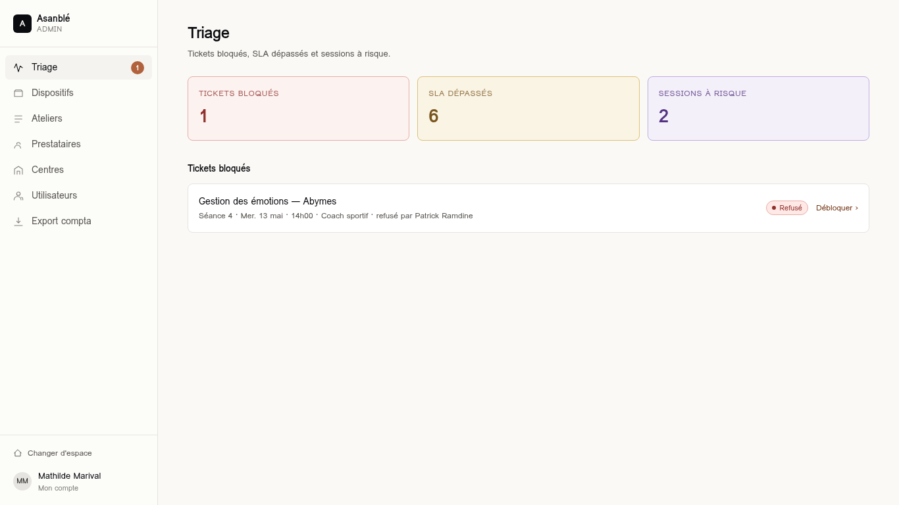
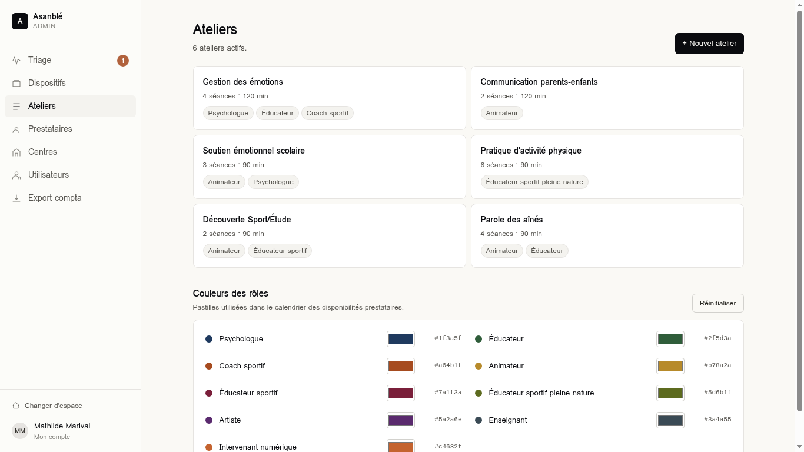
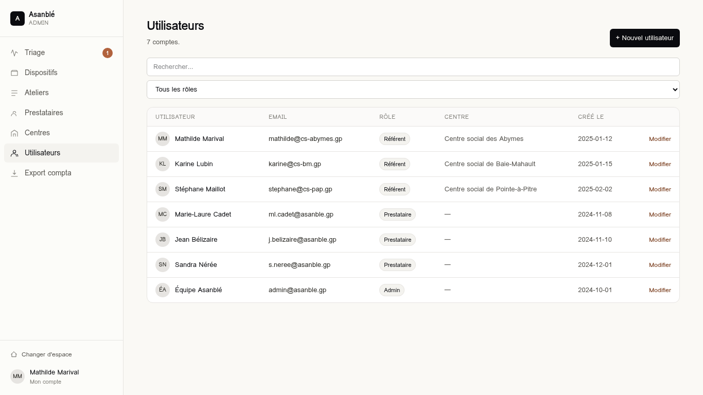

# 07 — Espace Admin Asanblé

URL préfixe : `/admin/*`. Layout : `src/routes/admin.tsx` (`AdminLayout`) qui
applique `setCurrentUserByRole("admin")` au mount.

## Sidebar

| Label | Route | Badge dynamique |
| --- | --- | --- |
| Dashboard | `/admin` (exact) | Nb tickets `refused | blocked` |
| Projets | `/admin/projects` | — |
| Ateliers | `/admin/workshops` | — |
| Prestataires | `/admin/providers` | — |
| Centres | `/admin/centers` | — |
| Utilisateurs | `/admin/users` | — |
| Export compta | `/admin/export` | — |

---

## Écran : Dashboard administrateur

- **Route** : `/admin` (exact)
- **Fichier** : `src/routes/admin.index.tsx`

C'est la page d'atterrissage de l'admin : un **tableau de bord
opérationnel** qui résume tout ce qui demande une intervention humaine sur la
plateforme. L'admin doit pouvoir, en un coup d'œil, voir s'il y a une crise
en cours (tickets bloqués), des prestataires lents (SLA dépassés) ou des
sessions qui risquent de ne pas avoir tous les rôles couverts à la date prévue.

### Sections

1. **Header** : "Dashboard administrateur" + sous-titre explicatif.
2. **3 stats KPI** (cartes colorées) avec un texte d'aide sous chaque chiffre :
   - **Tickets bloqués** (rouge) : tickets refusés par le prestataire ou
     marqués bloqués par le système. Action immédiate requise.
   - **Délais dépassés** (jaune) : tickets `pending` depuis plus que la durée
     SLA (24 h par défaut). À relancer.
   - **Sessions à risque** (violet) : sessions ayant au moins une séance avec
     un ticket refusé ou vide.
3. **Légende SLA** : rappel inline que <em>SLA = Service Level Agreement</em>
   = délai de réponse attendu d'un prestataire (24 h par défaut).
4. **Liste "Tickets bloqués"** : cartes avec workshop + ville, séance + date
   + rôle (+ "refusé par <nom>" si applicable), `StatusChip`, lien
   "Débloquer ›" → `/app/sessions/$sessionId/seances/$n` (vue référent).

### Règles

- `blocked = tickets.filter(t => t.status === "refused" || t.status === "blocked")`.
- `pendingOver24h` = `tickets.filter(status === "pending")` (à raffiner avec
  `sentAt + 24h`).
- `sessionsAtRisk` = sessions ayant au moins un ticket `refused` ou `empty`.

### Évolutions

- Filtres : par centre, par projet, par projet financeur.
- Action "Forcer la confirmation" (status `override`) avec audit log.
- "Notifier le référent" en un clic.

---

## Écran : Projets

- **Route** : `/admin/projects`
- **Fichier** : `src/routes/admin.projects.tsx`
- **Données** : `projectsStore`, `workshopsStore`, `centersStore`.

### Sections

1. **Header** : titre + compteur, sous-titre, CTA primaire **+ Nouveau projet**
   (ouvre `SideDrawer`).
2. **Liste** de cartes projet :
   - Nom + description (ex. "REAAP 2025 — Réseau Écoute Appui…").
   - Ligne meta : `<n> centres · Budget X € · Période JJ/MM/AAAA → JJ/MM/AAAA · Financeur …`.
   - Pills des ateliers rattachés (lecture seule).

### `SideDrawer` "Nouveau projet"

Champs (formulaire) :
- **Nom du projet** (required, ex. "REAAP 2026").
- **Description courte** (optionnelle).
- **Financeur** (texte libre : CAF, ARS, DRAC, Région…).
- **Budget** (number, en euros).
- Grille 2 colonnes : **Début** + **Fin** (date pickers natifs).
- **Centres concernés** : liste de checkboxes scrollable (`max-h-[160px]`),
  multi-sélection sur tous les centres du `centersStore`. Compteur dans le label.
- **Ateliers du projet** : multi-toggle pills (mêmes interactions que
  l'écran Ateliers). Compteur dans le label.

Footer : "Créer le projet" (disabled si nom vide) / "Annuler". Sortie ou
fermeture → reset complet du formulaire.

### Règles métier

- À la création : push dans `projectsStore`, `id = pr${Date.now()}`,
  `createdAt = today (YYYY-MM-DD)`. Aucune validation de doublon.
- `centerIds` et `workshopIds` peuvent être vides à la création (un projet
  peut être instruit avant que les centres/ateliers ne soient connus).

### Évolutions

- Édition / archivage d'un projet existant.
- Page détail : sessions actives par centre, taux de couverture, dépenses
  consolidées vs budget, exports comptables filtrés par projet.
- Lier les sessions à un projet (champ `projectId` sur `Session`) pour
  agréger automatiquement séances et tickets.
- Validation d'unicité du nom + plage de dates cohérente (`startDate <= endDate`).

---

## Écran : Ateliers

- **Route** : `/admin/workshops`
- **Fichier** : `src/routes/admin.workshops.tsx`
- **Données** : `workshopsStore`, `roleColorsStore`.

### Sections

1. **Header** : titre + compteur, CTA primaire **+ Nouvel atelier** (ouvre
   `SideDrawer`).
2. **Grille 2 colonnes** de cartes ateliers (nom, "<n> séances · <durée>
   min", liste des rôles requis en pills).
3. **Panneau "Couleurs des rôles"** :
   - Header : titre + "Réinitialiser" (rétablit `DEFAULT_ROLE_COLORS`).
   - Liste à 2 colonnes ; chaque ligne :
     - `RoleDot` (preview live)
     - Nom du rôle
     - `<input type="color">`
     - Code hexa en `<code>`
   - Modification immédiatement répercutée dans `/app/availability`.

### `SideDrawer` "Nouvel atelier"

Champs (formulaire) :
- Nom de l'atelier (required).
- Grille 2 colonnes : Nombre de séances (number 1..50, défaut 4),
  Durée en min (number step 15, défaut 90).
- Rôles requis : multi-toggle (pills cliquables) parmi les 9 rôles.

Footer : "Créer l'atelier" (disabled si nom vide) / "Annuler".

### Règles

- À la création : push dans `workshopsStore`. Pas de validation des doublons
  (à ajouter).

### Évolutions

- Édition / archivage d'un atelier existant.
- Lier l'atelier à un projet (financeur).
- Validation : `requiredRoles.length >= 1`.

---

## Écran : Prestataires

- **Route** : `/admin/providers`
- **Fichier** : `src/routes/admin.providers.tsx`

### Sections

1. **Header** : titre + compteur, CTA **+ Inviter** (ouvre une modale centrée).
2. **Liste plate** (1 colonne) : avatar, nom, "<rôles> · <ville>",
   badge "Validé" (vert).

### Modale "Inviter un prestataire"

Champs :
- Nom complet.
- Email + Téléphone (grille 2 cols).
- Commune.
- **Rôles** : checkbox multi-sélection dans une zone scrollable
  `max-h-[180px]`, listant les 9 rôles (besoins du projet).

Footer : "Envoyer l'invitation" (disabled si nom vide ou aucun rôle) / "Annuler".

### Évolutions

- Vraie invitation par email avec magic link.
- Statuts prestataire : invited / active / archived.
- Page détail prestataire (historique missions, taux d'acceptation, notation).

---

## Écran : Centres sociaux

- **Route** : `/admin/centers`
- **Fichier** : `src/routes/admin.centers.tsx`

### Sections

1. **Header** : titre + compteur, CTA "+ Ajouter" (non câblé).
2. **Grille 2 colonnes** de cartes centres : nom, adresse, "Référent · <nom>",
   téléphone (`tel:` link) + email (`mailto:` link, si présent).

### Évolutions

- Câbler "+ Ajouter" sur un drawer/formulaire.
- Édition (nom, adresse, contact, email).

---

## Écran : Utilisateurs

- **Route** : `/admin/users`
- **Fichier** : `src/routes/admin.users.tsx`
- **Données** : `accountsStore`, `centersStore`.

### Sections

1. **Header** : titre + compteur, CTA primaire **+ Nouvel utilisateur** (ouvre modale).
2. **Filtres** : recherche texte (nom/email) + select rôle (Tous /
   Référents / Prestataires / Admins).
3. **Tableau** : Utilisateur (avatar + nom), Email, Rôle (pill), Centre
   affilié, Date de création, action "Modifier" (non câblée).

### Modale "Nouvel utilisateur"

Champs :
- Prénom + Nom (grille 2 cols).
- Email.
- Rôle (select : Référent famille / Prestataire / Admin).
- Centre social affilié (select dynamique, **affiché uniquement si rôle ===
  "referent"**).

Footer : "Créer le compte" (disabled si prénom/nom/email vide) / "Annuler".

### Règles

- À la création : push dans `accountsStore`, `id = u${Date.now()}`,
  `createdAt = today`.
- `centerId` est conservé uniquement si `role === "referent"`.

### Évolutions

- Champ "Prestataire associé" si `role === "provider"`.
- Génération auto du mot de passe + envoi par email d'activation.
- Action "Modifier" : drawer édition.
- Désactivation / suppression d'un compte.

---

## Écran : Export comptable

- **Route** : `/admin/export`
- **Fichier** : `src/routes/admin.export.tsx`
- **État** : maquette statique.

### Sections

Formulaire :
- Période (deux date pickers).
- Centre social (select).
- Prestataire (select).
- Format (CSV / XLSX, deux boutons toggle).
- Bouton primaire pleine largeur "Générer l'export".

### Évolutions

- Server function streamée (CSV ou XLSX via SheetJS côté serveur).
- Colonnes : Centre, Atelier, Session, Séance, Date, Prestataire, Rôle,
  Durée, Statut, Tarif horaire, Total HT.

---

## Espace Projet (workspace dédié)

Quand l'admin clique sur la carte d'un projet dans `/admin/projects`, il
entre dans un **espace projet** indépendant avec sa propre sidebar.

- **Route racine** : `/projects/$projectId`
- **Layout** : `src/routes/projects.$projectId.tsx`
- Header sidebar : nom du projet (brand) + label "Projet".
- **Top slot** (au-dessus du menu) : sélecteur `<select>` listant tous les
  projets pour switcher instantanément + lien "← Tous les projets".

### Sidebar contextuelle

| Label | Route | Fichier |
| --- | --- | --- |
| Vue d'ensemble | `/projects/$projectId` (exact) | `projects.$projectId.index.tsx` |
| Paramètres | `/projects/$projectId/settings` | `projects.$projectId.settings.tsx` |
| Centres | `/projects/$projectId/centers` | `projects.$projectId.centers.tsx` |
| Ateliers | `/projects/$projectId/workshops` | `projects.$projectId.workshops.tsx` |
| Sessions | `/projects/$projectId/sessions` | `projects.$projectId.sessions.tsx` |

### Vue d'ensemble

3 KPI (Centres, Ateliers, Budget) + cartes Informations / Centres rattachés /
Ateliers. Bouton **"Modifier le projet"** → `/settings`.

### Paramètres

Formulaire d'édition (mêmes champs que la création) + bouton **Supprimer le
projet** (rouge, confirm). À la sauvegarde, mise à jour `projectsStore`.

### Sessions

Liste filtrée des `sessions` dont `workshopId ∈ project.workshopIds` ET
`centerId ∈ project.centerIds`. Lien vers la vue détail référent.

### Accès

L'admin entre via `/admin/projects` :
- clic sur la carte → `/projects/$projectId` (vue d'ensemble)
- clic sur **✎ Modifier** → `/projects/$projectId/settings` directement

### Documents prestataire (admin)

Depuis `/admin/providers`, chaque ligne expose un bouton **"Documents"** →
`/admin/providers/$providerId/documents`. L'admin peut téléverser des
documents pour le prestataire ; il ne peut supprimer que ceux qu'il a
lui-même déposés (le prestataire conserve la suppression de ses propres
fichiers).
