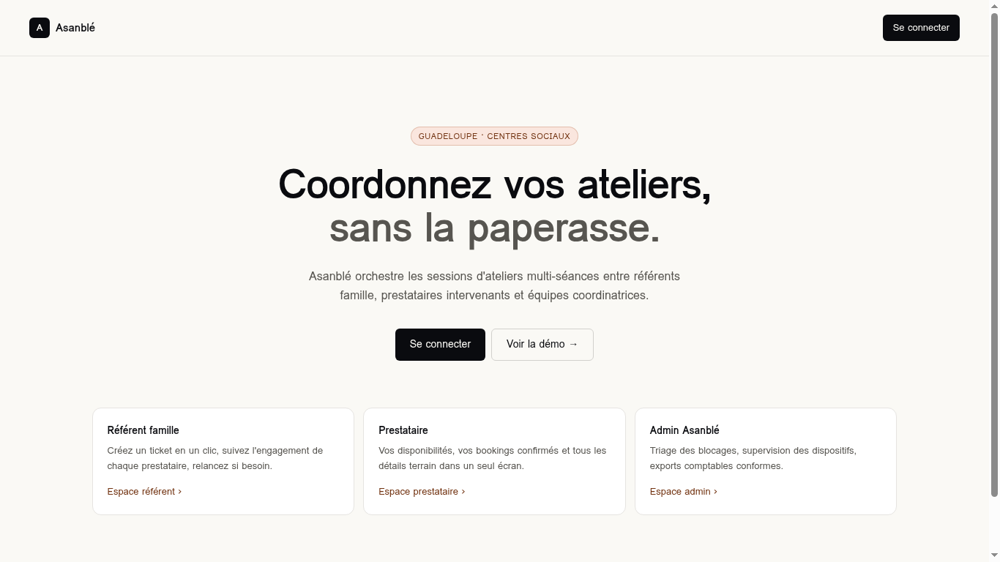

# 08 — Pages publiques & Compte

## Landing

- **Route** : `/`
- **Fichier** : `src/routes/index.tsx`
- **Accès** : public.

### SEO (`head()`)

- `title` : "Asanblé — Booking d'ateliers pour centres sociaux en Guadeloupe"
- `description` : "Le SaaS qui simplifie la coordination de séances
  d'ateliers entre référents famille, prestataires et équipes Asanblé."
- `og:title`, `og:description` répliqués.

### Sections

1. **Topbar** : logo + nom, bouton primaire **Se connecter** (à droite).
2. **Hero** centré (max-w 920) :
   - Pill accent "Guadeloupe · Centres sociaux".
   - `<h1>` 40-56px : "Coordonnez vos ateliers, **sans la paperasse.**"
   - Sous-titre 16px max-w 560.
   - 2 boutons : **Se connecter** (primaire) + **Voir la démo →** (vers `/app`).
3. **Section 3 cartes** (grid md:3) : Référent famille / Prestataire / Admin
   Asanblé. Chaque carte : titre, description, lien `accent-ink` → espace
   correspondant.
4. **Footer** : "© Asanblé — Pointe-à-Pitre" + "fr-FR · GMT-4".

### Règles

- **Pas de bouton "Créer un compte"** sur la landing — uniquement
  "Se connecter" (cf. correction utilisateur).
- **Pas de phrase** "Plus de tableaux Excel, plus de coups de fil perdus."
  (cf. correction utilisateur).

### Évolutions

- Brancher "Se connecter" sur la vraie auth.
- A/B test du hero.

---

## Login

- **Route** : `/login`
- **Fichier** : `src/routes/login.tsx`
- **Accès** : public.

### Sections

- Carte centrée 380px : titre "Connexion", sous-titre, formulaire (Email,
  Mot de passe, bouton "Se connecter"), liens "Mot de passe oublié ?" et
  "Créer un compte".
- Note démo en bas.

### Comportement actuel

`onSubmit` → `navigate({ to: "/app" })` (pas de vraie auth).

### Évolutions

- Brancher Lovable Cloud Auth (email/password).
- Rediriger vers `/app`, `/pro` ou `/admin` selon le rôle du compte.
- Sign in with Google / Apple.

---

## Signup

- **Route** : `/signup`
- **Fichier** : `src/routes/signup.tsx`
- **Accès** : public.

### Sections

- Sélecteur de profil (2 cartes) : "Centre social" (référent) /
  "Prestataire".
- Formulaire : Nom (champ contextualisé), Email, Mot de passe.
- Bouton "Créer mon compte" (non câblé).

### Évolutions

- En production, ne pas exposer Signup public — la création de compte se fait
  par invitation depuis `/admin/users` ou `/admin/providers` (cf. correction
  utilisateur sur la landing).

---

## Mot de passe oublié

- **Route** : `/forgot-password`
- **Fichier** : `src/routes/forgot-password.tsx`

Carte 380px : email + "Envoyer le lien" (non câblé) + retour vers `/login`.

### Évolutions

- Brancher sur Lovable Cloud Auth `resetPasswordForEmail`.

---

## /account — Mon compte

- **Route** : `/account`
- **Fichier** : `src/routes/account.tsx`
- **Accès** : tout utilisateur connecté.
- **Données lues** : `currentUserStore`, `centersStore`.
- **Données écrites** : `currentUserStore` + `accountsStore` (synchro).

### Layout

Page indépendante (sans `AppShell`) :
- **Header global** : logo Asanblé + lien "← Retour" (vers `/app`, `/pro`
  ou `/admin` selon rôle).
- Body `max-w-[760px]`.

### Sections

1. **Identité** : avatar 64 + nom + "<rôle> · <centre>".
2. **Carte "Informations"** :
   - Prénom, Nom (grille 2 cols).
   - Email (full width).
   - Centre social affilié (lecture seule, **uniquement si référent**).
   - Bouton "Enregistrer" + check vert "✓ Modifications enregistrées" (timeout 2s).
3. **Carte "Mot de passe"** :
   - Nouveau mot de passe (8 caractères min) + Confirmer.
   - Validation inline si mismatch.
   - Bouton "Modifier le mot de passe" (disabled si invalide).

### Règles

- Le centre social affilié n'est **jamais modifiable** par l'utilisateur lui-même
  — seul l'admin peut le changer (depuis `/admin/users`).
- Lien "← Retour" calculé via `user.role`.

### Évolutions

- Vraie mise à jour Supabase Auth + table `profiles`.
- Upload d'une photo de profil (remplace l'avatar initiales).
- Sécurité : exiger le mot de passe actuel pour le changer.
